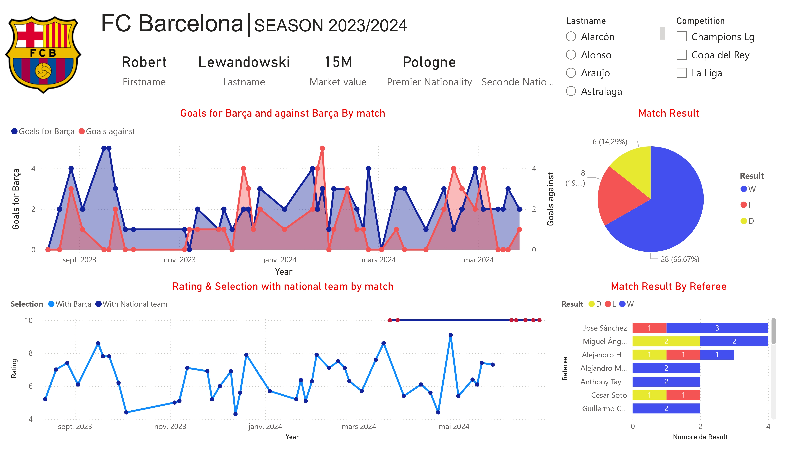

# FC Barcelona Performance Analysis Project

## Project Overview  
This project focuses on analyzing the performance of FC Barcelona during the 2023/2024 season. It explores three key research questions:  
1. How do players’ performances at the club level influence their selection for national teams?  
2. How do a coach's tactical choices influence game results?  
3. How do weather conditions impact match outcomes?  
\
By leveraging modern data analysis tools and techniques, the project provides insights into the internal and external factors that affect team performance.  

## Goals  
- Analyze player performance and its relationship with national team selection.  
- Analyze the impact of formations chosen by the coach and the opposing team on match results.  
- Study the influence of weather conditions on match outcomes.  

## Tools and Technologies  
The project employs a range of technologies for data collection, transformation, storage, and visualization:  

- **Data Collection & Transformation**:  
  - **Python**: The main programming language for the project.  
  - **BeautifulSoup**: Web scraping library for extracting data from relevant websites.  
  - **Google Colab**: Cloud-based environment for collaborative coding and data preprocessing.  
  - **CSV Format**: Used as an intermediary format for storing structured data.  

- **Database**:  
  - **Oracle Database**: Relational database for storing structured, normalized data. Tables were designed to represent key entities such as players, matches, and weather.  

- **Visualization**:  
  - **Power BI**: Dashboarding tool for creating interactive visualizations to analyze and present findings.  

## Dashboards  

### 1. Dashboard: Player Performances  
This dashboard highlights:  
- Player Information (Name, Market Value, Nationality, and Second Nationality or Origin).  
- Barcelona's Match Results (Goals Scored by Barça and Goals Conceded).  
- A circle chart showing how many matches Barcelona won, lost, or drew.  
- The selected player's ratings in every Barcelona match and their inclusion in national team matches.  
- Match results by referee.

#### Lewandowski Performances Dashboard

  

#### Lamine Yamal Performances Dashboard

### 2. Dashboard: Match Results by Barcelona and Opponent Formation  
This dashboard provides a detailed analysis of FC Barcelona's match results, comparing the formations used by the team and their opponents. The goal is to better understand how tactical choices influence team performance and identify key trends in matchups against opponents.  

  

### 3. Dashboard: Overall Trends  
This dashboard presents a comprehensive correlation analysis of various factors influencing FC Barcelona's match results. It highlights the relationships between key variables such as possession, temperature, humidity, wind speed, etc. By visualizing the correlations, this dashboard helps uncover patterns and insights that may reveal how different environmental and match-related factors impact the team's performance.  

  

## Project Structure  
- **Data Collection**: Scraped match, player, and weather data from various sources using Python and BeautifulSoup.  
- **Database Design**: Stored the data in a relational database (Oracle) using a normalized schema to facilitate complex analysis and avoid redundancy.  
- **Data Visualization**: Built dashboards in Power BI to explore and present insights interactively.  

## Challenges and Solutions  
1. **Challenge**: Finding reliable websites for web scraping.  
   - **Solution**: Focused on reputable sources with consistent data structures.  
2. **Challenge**: Integrating data from multiple sources into the database.  
   - **Solution**: Used structured workflows and validation checks to ensure data consistency.  

## Conclusion  
This project successfully analyzed multiple factors influencing FC Barcelona’s performance:  
- Clear patterns were identified in how player performances impact national team selections.  
- Weather conditions were found to have measurable effects on match outcomes.  
- The structured approach, leveraging a relational database and interactive dashboards, ensures scalability and flexibility for future analyses.  

The methodology can be adapted to analyze other teams, competitions, or sports, providing a versatile framework for sports analytics.  

## Future Work  
- Extend the analysis to include other football clubs or leagues.  
- Incorporate advanced machine learning techniques to predict match outcomes or player performance trends.  
- Automate the data pipeline for real-time analysis.  

## Authors  
- Reda Lamhattat  
- Ouail Gaddar  
- Youness Aithassoune  

## Data Sources  
The data for this project was scraped from the following websites:  

- [OpenWeather](https://openweathermap.org/api)  
- [FBREF](https://fbref.com/en/)  
- [Transfermrkt](https://www.transfermarkt.fr/) 
- [FOOTMERCATO](https://www.footmercato.net/) 
